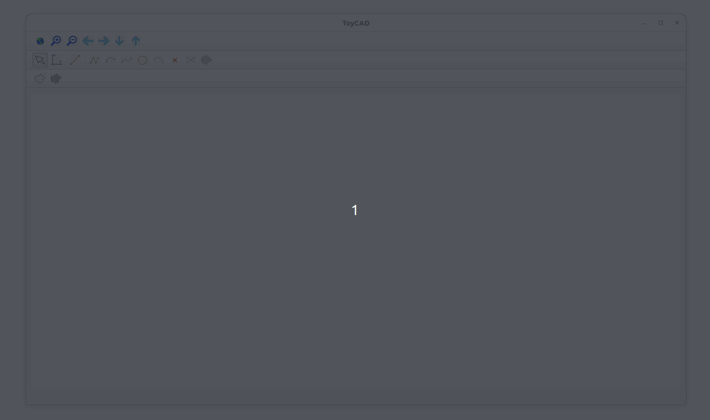

# ToyCAD
ToyCAD is a toy version of a Computer Aided Design (CAD) system written in C++. This 
was also my fifth project for the class Sistemas Gráficos para Engenharia - 2020.1, see [here](http://webserver2.tecgraf.puc-rio.br/~lfm/compgraf-201/) for more informations. Currently, the application is only compilling
on Linux machines. 

# Features
Here are all the features inside the app:
- Canvas interaction: fit world to viewport, translate world, zoom in and zoom out, snap to grid
- Curve management: draw and delete the following set of curves: line, polyline, circle, arc of circle, 
quadratic Bézier, cubic Bézier and curve intersection
- Mesh Generation: Once your set of curves encloses a bounded region, you can define a mesh for it
with three distinct methods: bilinear mapping (for regions with four distinct curves), trilinear mapping (for regions
with three distinct curves) and delaunay triangulation (works for any region)

A demo with some features is shown in the following gif:
